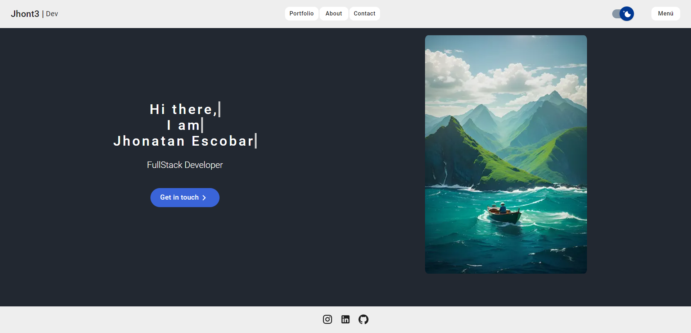

# MY PORTFOLIO AS SOFTWARE DEVELOPER

This is my repository where I showcase my previous projects using the GitHub API. 

## Introduction
To create this project I used NextJs and Material UI and I was based myself on the Front End section of the course I'm taking "Next.js: The React framework for production" made by Fernando Herrera, available at devtalles.com.

[Portfolio](https://my-portfolio-nextjs-three.vercel.app/)

